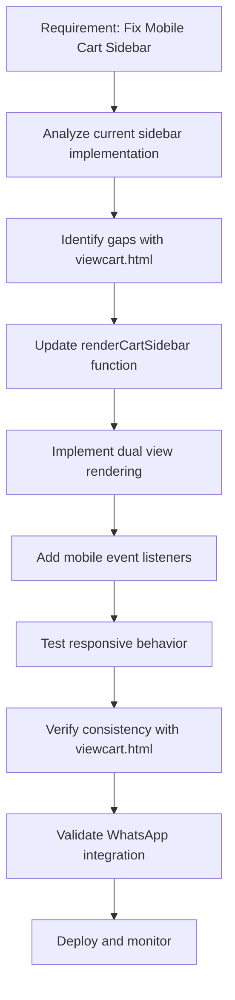

# Mobile View Cart Sidebar Issue - Items Tabular Not Displaying

## Problem Statement

In the mobile view of the website, the cart sidebar is not properly displaying the items in a tabular format. Users are unable to see their cart items when accessing the site on mobile devices, which affects the shopping experience and prevents them from managing their cart effectively.

## Current Implementation Analysis

### Cart Sidebar Structure
The current implementation has inconsistencies between different pages:
- **viewcart.html**: Implements both desktop table and mobile card views with proper responsive behavior
- **Cart Sidebar (cart.js)**: Only implements the desktop table structure without mobile view

### Identified Issues
1. The cart sidebar in mobile view hides the desktop table with CSS (`display: none`) but fails to render an alternative mobile view
2. The `renderCartSidebar()` function in cart.js only generates the desktop table markup without mobile card view markup
3. Missing event listeners for mobile view elements in the cart sidebar
4. Inconsistent user experience between viewcart.html and cart sidebar on mobile devices

## Root Cause

The inconsistency between implementations causes the mobile view issue:

1. **viewcart.html** correctly implements the responsive design pattern with both table and mobile card views
2. **cart.js** `renderCartSidebar()` function was not updated to match this dual-view approach
3. CSS media queries properly handle responsive switching, but there's no content to display on mobile in the sidebar

## Implementation Workflow

Following the established cart table structure implementation workflow:



## Proposed Solution

### Approach 1: Implement Dual View Rendering in Cart Sidebar (Recommended)

Modify the `renderCartSidebar()` function in cart.js to render both desktop table and mobile card views, matching the implementation in viewcart.html:

1. Update the `renderCartSidebar()` function to generate both table and mobile card markup
2. Ensure proper CSS classes are applied for responsive behavior
3. Add event listeners for mobile view elements
4. Maintain consistency with the existing viewcart.html implementation

### Approach 2: Responsive Table Modification

Modify the existing table structure to be responsive on mobile:
1. Adjust CSS to make the table structure work on mobile devices
2. Apply responsive table patterns (horizontal scrolling or stacked rows)
3. Retain the single rendering approach but make it mobile-friendly

## Detailed Implementation Plan

### Frontend Changes

#### 1. Update renderCartSidebar() Function (cart.js)

Modify the function to render both desktop and mobile views like viewcart.html:

```javascript
function renderCartSidebar() {
  // ... existing code ...
  
  // Create both table and mobile structures (matching viewcart.html)
  const tableHTML = `<!-- desktop table structure -->`;
  const mobileHTML = `<!-- mobile card structure -->`;
  
  itemsContainer.innerHTML = tableHTML + mobileHTML;
  
  // Attach event listeners for both views
  // ... event listener code for both views ...
}
```

#### 2. CSS Adjustments

Ensure the cart sidebar mobile view CSS properly handles:
- Display switching between table and mobile views (matching existing patterns)
- Consistent styling with the main viewcart page
- Proper spacing and touch targets for mobile (60px×60px images)

### Expected Outcomes

1. Mobile users will be able to see their cart items in a properly formatted view
2. Consistent user experience across desktop and mobile platforms
3. Maintained functionality for quantity adjustment and item removal
4. Improved accessibility and usability on smaller screens

## Testing Strategy

1. Test on various mobile screen sizes (iPhone, Android devices)
2. Verify cart item display and functionality
3. Check quantity adjustment and item removal
4. Confirm responsive behavior across different breakpoints
5. Validate consistency with viewcart.html implementation

## Rollback Plan

If issues arise after deployment:
1. Revert cart.js to previous version
2. Monitor user feedback and error logs
3. Implement hotfix based on identified issues

## Success Metrics

1. Mobile users can view and manage cart items without issues
2. Reduced user complaints about cart visibility on mobile
3. Improved mobile conversion rates
4. No regression in desktop cart functionality
