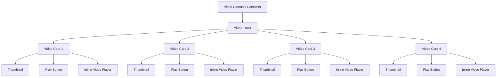
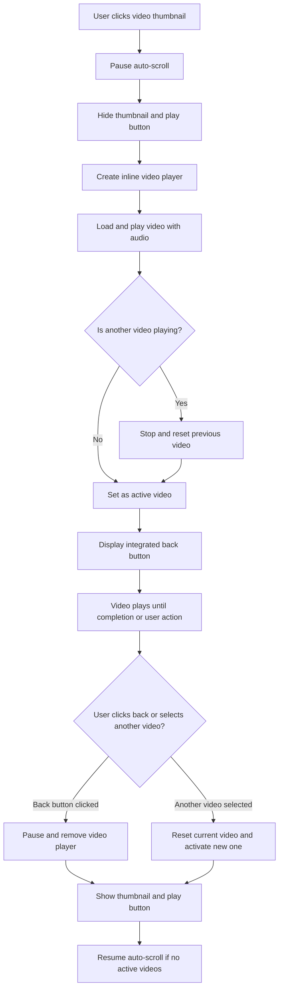

# Looping Video Carousel Design Document

## Overview

This document outlines the design for implementing a looping video carousel feature in the "The Delicious Food Making" section of the JRavah website. The feature will enable continuous scrolling of video thumbnails with controlled playback behavior where only one video plays at a time, and scrolling pauses during interactions.

## Feature Requirements

Based on the user requirements, the following behaviors must be implemented:

1. **Continuous Looping Scroll**: The video thumbnails should continuously scroll in a loop
2. **Single Video Playback Isolation**: Only one video should play at a time
3. **Automatic Reset**: When a new video is selected, the previous one should automatically pause and reset to thumbnail view
4. **Scroll Control**: Scrolling should pause when hovering over the section or when a video is playing
5. **Playback Resumption**: Users should be able to resume playing previously played videos
6. **Loop Restart**: When returning to the first video after playing subsequent ones, it should play normally

## System Architecture

### Component Structure



### Key Components

| Component | Description |
|-----------|-------------|
| Video Carousel Container | Main wrapper for the entire carousel section |
| Video Track | Horizontal container that holds all video cards and implements scrolling |
| Video Card | Individual container for each video with thumbnail, play button, and inline player |
| Thumbnail | Static image representation of the video content |
| Play Button | Interactive element to initiate video playback |
| Inline Video Player | Embedded video player that replaces thumbnail when activated |

## Functional Flow

### 1. Initial State
- Video thumbnails are displayed in a horizontally scrolling track
- Animation creates a continuous loop effect
- All play buttons are visible and interactive

### 2. User Interaction Flow



### 3. Scrolling Control Logic

| Trigger | Action |
|---------|--------|
| Mouse hover over carousel | Pause auto-scroll |
| Touch interaction on mobile | Pause auto-scroll |
| Video playback starts | Pause auto-scroll |
| Video playback ends/back button clicked | Resume auto-scroll after delay |
| Another video selected | Reset previous video, maintain scroll pause |

## Technical Implementation Strategy

### 1. HTML Structure Modifications

The existing video section in `JRavah.html` will be enhanced to support the new functionality:

```html
<section id="videos">
  <div class="section-wrapper">
    <h2 class="section-title">The Delicious Food Making</h2>
    <p>Peek inside our kitchen as we stir, grind, and pickle with love.</p>
    <div class="videos-wrapper">
      <div class="videos-track" id="videosTrack">
        <!-- Video cards will be cloned for seamless looping -->
        <div class="video-card" data-video-id="ChickenPickle">
          
          <button class="custom-play-btn" aria-label="Play Chicken Pickle video">▶</button>
        </div>
        <!-- Additional video cards -->
      </div>
    </div>
  </div>
</section>
```

### 2. CSS Enhancements

Key enhancements to `food-videos.css`:

- Improved infinite scrolling animation with seamless looping
- Enhanced hover and touch interaction states
- Responsive adjustments for various screen sizes
- Visual feedback for active video states

### 3. JavaScript Functionality

Core functions to be implemented in `food-videos.js`:

#### State Management
```javascript
let activeVideoCard = null;  // Reference to currently playing video card
let autoScrollPaused = false;  // Flag to track scroll state
let videoElements = {};  // Registry of all video elements
```

#### Video Control Functions
- `playVideo(card)` - Initializes video playback in a card
- `resetVideo(card)` - Stops and resets a video to thumbnail state
- `pauseAllVideosExcept(current)` - Ensures only one video plays at a time
- `stopAutoScroll()` - Pauses the scrolling animation
- `resumeAutoScroll()` - Resumes scrolling after appropriate delay

#### Event Handlers
- Click handlers for play buttons
- Hover/touch handlers for scroll control
- Back button handlers for video reset
- Window focus/blur handlers for proper video management

## Data Model

### Video Card State

| Property | Type | Description |
|----------|------|-------------|
| id | String | Unique identifier for the video card |
| videoSource | String | Path/URL to the video file |
| thumbnail | String | Path to the thumbnail image |
| isActive | Boolean | Indicates if video is currently playing |
| isVisible | Boolean | Indicates if card is in viewport |

### Global State

| Property | Type | Description |
|----------|------|-------------|
| activeVideoId | String | ID of currently playing video |
| isScrolling | Boolean | Current scroll state |
| scrollSpeed | Number | Current scrolling speed |
| userInteracting | Boolean | Indicates if user is interacting with carousel |

## User Experience Specifications

### Visual Design
- Consistent with existing JRavah design language
- Clear visual distinction between thumbnail and active video states
- Intuitive play and back button controls
- Smooth transitions between states

### Interaction Design
- Immediate response to user actions
- Clear feedback when videos start/stop
- Predictable behavior during sequential video selection
- Appropriate scroll behavior based on context

### Accessibility
- Proper ARIA labels for all interactive elements
- Keyboard navigable controls
- Sufficient color contrast for all UI elements
- Screen reader compatible state announcements

## Performance Considerations

### Resource Management
- Lazy loading of video assets
- Cleanup of unused video elements
- Efficient DOM manipulation
- Optimized animation performance

### Memory Management
- Removal of video elements when not in use
- Prevention of memory leaks through proper event cleanup
- Efficient storage of video state information

## Error Handling

### Video Playback Failures
- Graceful degradation to thumbnail view
- User-friendly error messaging
- Automatic retry mechanisms for transient failures

### Network Issues
- Offline fallback to static content
- Bandwidth-aware video quality selection
- Progressive enhancement for enhanced features

## Browser Compatibility

The implementation will support:
- Latest versions of Chrome, Firefox, Safari, and Edge
- Mobile browsers on iOS and Android
- Progressive enhancement for older browsers

## Testing Strategy

### Unit Tests
- Video playback initialization and reset
- Scroll control activation and deactivation
- Sequential video selection behavior
- State management across interactions

### Integration Tests
- End-to-end user flows
- Cross-browser compatibility
- Responsive behavior across devices
- Performance under various network conditions

## Deployment Considerations

### File Organization
- Minimal changes to existing file structure
- Clear separation of concerns in CSS and JavaScript
- Backward compatibility with existing functionality

### Rollout Plan
- Staged deployment to production
- Monitoring of user interactions and performance metrics
- Gradual rollout with rollback capability- Monitoring of user interactions and performance metrics
