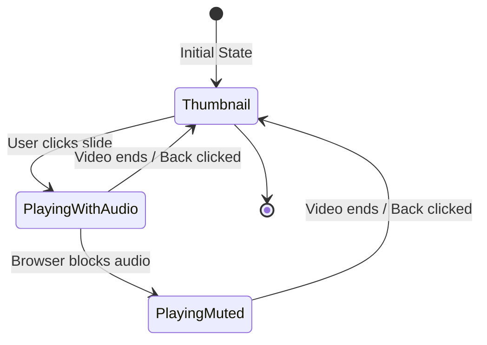
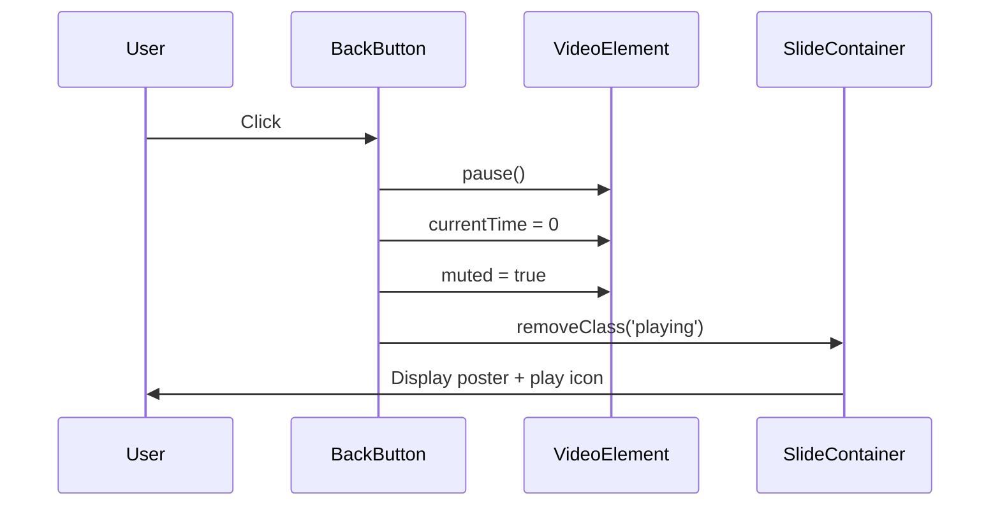

# Video Interaction and Home Section Optimization

## 1. Overview

This design addresses two distinct optimization areas for the JRavah Foods website:

1. **Video Player Interaction Enhancement**: Enable audio playback and improve back button behavior in the video slider section
2. **Performance Optimization**: Resolve slow loading issues in the "Why Choose JRavah Foods?" section

## 2. Current State Analysis

### Video Player Section

**Location**: Home page (JRavah.html) - "The Delicious Food Making" section

**Current Behavior**:
- Videos are muted by default when playback begins
- Back button exists but may not properly restore thumbnail state
- Individual video isolation is implemented through jQuery/Slick carousel
- Four video slides with poster images displayed initially

**Issues Identified**:
- Audio remains muted during playback, preventing users from hearing video content
- Back button navigation may not properly reset video state to show poster image

### Why Choose JRavah Foods Section

**Location**: Home page (JRavah.html) - section with id "trust"

**Current Configuration**:
- Section contains four article cards with AOS (Animate On Scroll) fade-up animations
- Each card uses `data-aos="fade-up"` attribute
- AOS configuration: duration 900ms, offset 60px, once: true

**Issues Identified**:
- Section loads and animates slower compared to other page sections
- Visibility delay creates inconsistent user experience
- Multiple animated elements may cause cumulative performance impact

## 3. Design Goals

### Video Interaction
- Enable audio playback when users initiate video playback
- Ensure back button returns video to initial thumbnail state (poster image visible)
- Maintain single video playback isolation (only clicked video plays)
- Provide graceful fallback for browser autoplay restrictions

### Section Performance
- Eliminate perceived loading delay in "Why Choose JRavah Foods?" section
- Match visibility timing with other page sections
- Maintain visual consistency across all home page sections

## 4. Solution Design

### 4.1 Video Audio Enablement

#### Behavior Specification

When a user clicks a video slide to initiate playback:

| Event | Action | Expected Outcome |
|-------|--------|------------------|
| Slide Click | Unmute video element | `video.muted = false` |
| Play Initiated | Attempt playback with audio | Promise-based play execution |
| Browser Blocks Audio | Fallback to muted playback | Catch autoplay policy error |
| Video End | Reset to muted state | Prepare for next interaction |

#### State Transitions



#### Audio Unmuting Logic

The video click handler should modify the muted state before initiating playback:

1. Detect slide click event (excluding back button clicks)
2. Pause and reset all other videos in carousel
3. Set target video `muted` property to `false`
4. Add "playing" class to slide container
5. Invoke video `play()` method
6. Handle promise rejection if browser blocks autoplay with audio
7. On rejection, keep video playing in muted state (already handled in current implementation)

### 4.2 Back Button Behavior Enhancement

#### Current Implementation Analysis

The back button handler performs these operations:
- Pauses video
- Resets playback position to 0
- Sets muted to true
- Removes "playing" class

#### Required Enhancements

Ensure the back button reliably returns to the thumbnail view:

| Component | Expected State After Back Click |
|-----------|--------------------------------|
| Video Element | Paused, currentTime = 0, muted = true |
| Slide Container | Class "playing" removed |
| Poster Image | Visible (CSS controls via .playing class) |
| Play Icon | Visible (CSS controls via .playing class) |
| Back Button | Hidden (CSS controls via .playing class) |

The poster image visibility is controlled through CSS by the absence of the `.playing` class on the slide container. The current implementation should work correctly, but verification is needed to ensure the poster attribute properly displays when the video is paused and reset.

#### Interaction Flow



### 4.3 Performance Optimization for Trust Section

#### Root Cause Analysis

The "Why Choose JRavah Foods?" section loads slowly due to:

1. **Animation Timing**: AOS offset of 60px means animation triggers only when section scrolls 60px into viewport
2. **Multiple Animations**: Four separate fade-up animations executing simultaneously
3. **Animation Duration**: 900ms duration may feel slower compared to instant-loading sections

#### Optimization Strategy

**Option A: Remove Animation Delays**

Configure section to appear immediately without scroll-triggered animation:

| Current Setting | Optimized Setting | Rationale |
|----------------|-------------------|-----------|
| `data-aos="fade-up"` on each card | Remove `data-aos` attribute | Eliminate animation delay |
| AOS offset: 60px | N/A | Section loads immediately when visible |
| Duration: 900ms | N/A | Instant visibility |

**Option B: Optimize Animation Parameters**

Retain animation but reduce delay perception:

| Parameter | Current Value | Optimized Value | Impact |
|-----------|--------------|-----------------|--------|
| offset | 60px | 0px | Trigger immediately when entering viewport |
| duration | 900ms | 400ms | Faster animation completion |
| stagger | None | 50ms incremental delay | Sequential card appearance |

**Recommended Approach**: Option A - Remove Animations

Rationale:
- Other sections (categories, featured products) do not use staggered card animations
- Immediate visibility improves perceived performance
- Visual consistency with rest of the page
- Simpler implementation without AOS dependency for this section

#### Implementation Specification

Remove scroll animation from trust section cards while maintaining structure:

**Before**:
```
<article class="contact-card" data-aos="fade-up">
```

**After**:
```
<article class="contact-card">
```

Apply to all four article cards in the trust section. The section title can retain `data-aos="fade-up"` if desired for consistency with other section titles.

#### Alternative: Section-Level Optimization

If some animation is preferred, apply animation to the container instead of individual cards:

- Remove `data-aos` from individual article elements
- Apply `data-aos="fade-up"` to the `.category-grid` container
- Set `data-aos-offset="0"` to trigger immediately
- Set `data-aos-duration="500"` for faster animation

This animates all cards as a single unit, reducing cumulative animation delay.

## 5. Technical Considerations

### Browser Compatibility

**Autoplay Policies**:
- Modern browsers (Chrome 66+, Safari 11+, Firefox 66+) block autoplay with audio until user interaction
- The promise-based error handling ensures graceful degradation
- Users may see muted playback on first interaction, but can manually unmute if needed

**Video Poster Behavior**:
- Poster image displays when video is paused and currentTime is 0
- Different browsers may handle poster visibility slightly differently
- Explicit CSS control via `.playing` class ensures consistent behavior

### Performance Impact

**Video Audio**:
- Unmuting video has negligible performance impact
- Audio decoding happens in parallel with video rendering
- No additional network requests (audio stream already loaded)

**Animation Removal**:
- Removing AOS animations eliminates JavaScript animation observers
- Reduces reflow/repaint calculations during scroll
- Improves Cumulative Layout Shift (CLS) score
- Faster Time to Interactive (TTI) for section content

### Accessibility

**Video Controls**:
- Back button maintains `aria-label="Back to thumbnail"`
- Keyboard navigation should support Enter/Space on back button
- Video element does not have native controls attribute - custom controls only

**Section Visibility**:
- Removing animations makes content immediately available to screen readers
- No animation means no delay in accessing card content
- Improves experience for users with vestibular disorders

## 6. Implementation Checklist

### Video Interaction Enhancement

- [ ] Locate video click handler in JRavah.html inline script (around line 390-428)
- [ ] Before calling `video.play()`, set `video.muted = false`
- [ ] Verify promise-based error handling catches autoplay restrictions
- [ ] Test back button resets video to paused state with poster visible
- [ ] Confirm only one video plays at a time (isolation logic)
- [ ] Test across browsers (Chrome, Firefox, Safari, Edge)

### Performance Optimization

- [ ] Locate "Why Choose JRavah Foods?" section in JRavah.html (around line 236-262)
- [ ] Remove `data-aos="fade-up"` from four article.contact-card elements
- [ ] Optional: Keep `data-aos="fade-up"` on section title for consistency
- [ ] Test page load to verify section appears immediately when scrolled into view
- [ ] Compare loading speed with other sections visually
- [ ] Verify no layout shift occurs during section rendering
- [ ] Validate accessibility with screen reader

## 7. Testing Scenarios

### Video Functionality Tests

| Test Case | Steps | Expected Result |
|-----------|-------|-----------------|
| Audio Playback | Click video slide | Video plays with audio (if browser allows) |
| Audio Fallback | Click video in restrictive browser | Video plays muted without errors |
| Back to Thumbnail | Play video, click back button | Video stops, poster image shows, play icon visible |
| Video Isolation | Play video 1, click video 2 | Video 1 stops and resets, video 2 plays |
| End Behavior | Let video play to completion | Video resets to thumbnail automatically |

### Performance Tests

| Test Case | Steps | Expected Result |
|-----------|-------|-----------------|
| Section Visibility | Scroll to trust section | Cards appear immediately without delay |
| Consistency Check | Compare with categories section | Similar loading behavior |
| No Layout Shift | Scroll through entire page | Content stable, no sudden movements |
| Mobile Performance | Test on mobile device | Fast rendering on slower connections |

## 8. Success Metrics

### Video Interaction
- Users can hear audio when playing videos
- Back button reliably returns to thumbnail view in 100% of interactions
- No console errors related to video playback
- User feedback indicates improved video experience

### Section Performance
- "Why Choose JRavah Foods?" section loads as fast as other sections
- No perceptible delay when scrolling to section
- Improved Lighthouse performance score (if measurable)
- Consistent visual experience across all page sections

## 9. Rollback Plan

If issues arise after implementation:

**Video Changes**:
- Revert to `video.muted = true` before play if audio causes problems
- Original state: videos always muted during playback

**Section Changes**:
- Re-add `data-aos="fade-up"` attributes to article cards
- Original state: animated fade-up on scroll with 60px offset

Both changes are isolated and can be rolled back independently by restoring original attribute values.
